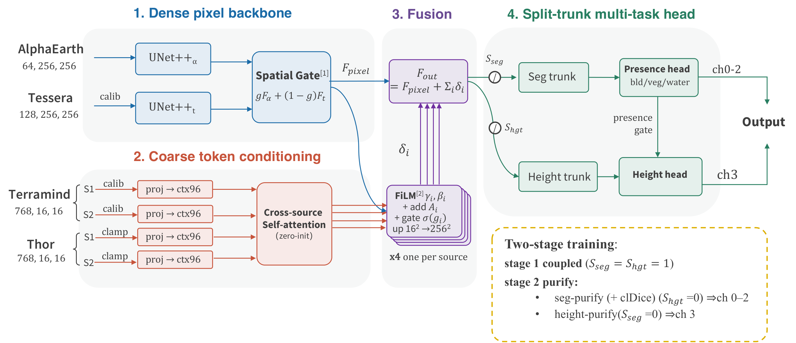
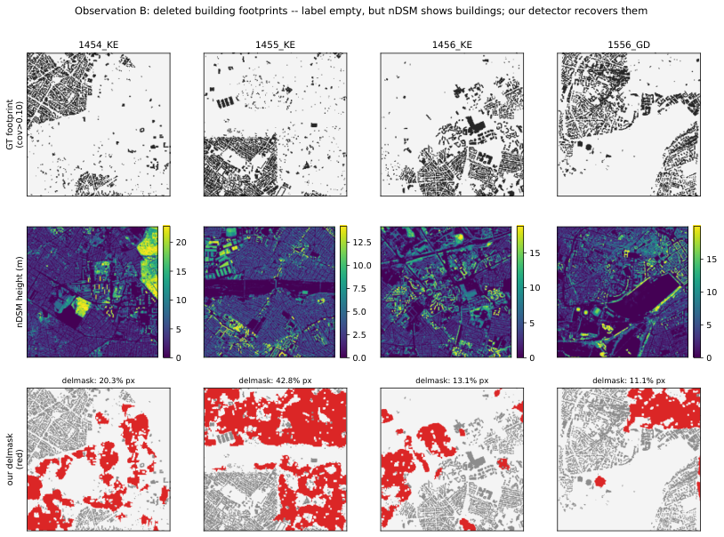

# Embed2Heights :Final Submission (reproducible)

> **Team: Attention_Plzzz**: Dingqi Ye, Daniel Kiv, Wen Zhou, Wei Hu, Ayush Khot
>
> CyberGIS Center for Advanced Digital and Spatial Studies
>
> University of Illinois at Urbana-Champaign

Reproduction package for our final leaderboard submission.

**Public score 0.5067** — `IoU_build 0.5032 / IoU_veg 0.8211 / IoU_water 0.5270 / RMSE_H_build 1.782 m / RMSE_H_veg 3.072 m`.

Per `256×256` tile we predict a `[building, vegetation, water, height(m)]` tensor from
the frozen challenge embeddings. Everyone gets the *same* embeddings — no raw imagery,
no external data — so the whole design is about matching the metric and squeezing
robust signal. Full method write-up: **`docs/framework_overview.pdf`**.

---

## Architecture



Three blocks (vector version in `docs/architecture.pdf`):

1. **Dense pixel backbone** — AlphaEarth (`64×256²`) and Tessera (`128×256²`) each go
   through a LightUNet; a learned **spatial gate** fuses them into `F_pixel`.
2. **Coarse token conditioning** — the 4 token sources (TerraMind / Thor, S1/S2, each
   `768×16²`) cross-attend, then modulate `F_pixel` via zero-init FiLM + additive + gate → `F_out`.
3. **Split-trunk multi-task head** — separate seg / height trunks feed the presence
   heads (ch 0-2) and the height specialists (ch 3).

Training is **two-stage** (coupled → *dual purify*); details below.

---

## 1. What the final submission is

An ensemble of **5 model variants × 5 leave-region-out folds**, each trained through
**4 stages**, combined into the 4-channel prediction:

| Ensemble member | `pixel_backbone_kind` | seeds |
|---|---|---|
| U-Net++ (nested decoder) | `unetpp` | 0, 1, 2 |
| UNet 3+ (full-scale skip) | `unet3plus` | 0 |
| TransUNet (attn bottleneck) | `unetpp_trans` | 0 |

Per member-fold, four checkpoints are produced off one stage-1 model:

```
stage 1        coupled seg+height, 50 ep                                 -> <exp>
  ├─ height-purify  20 ep, freeze seg    (presence-trunk-grad-scale 0)   -> <exp>_purify              (ch 3)
  └─ seg-purify     20 ep, freeze height (height-trunk-grad-scale 0)
                    + 20 ep clDice on top                                -> <exp>_segpurify, _cldice  (ch 0-2)
```

Final channels (`assemble_final.py`):
- **seg (ch 0-2)** = mean of **50** test predictions (25 `_cldice` + 25 `_segpurify`),
  binarised at OOF-tuned per-class thresholds + a water connected-component filter.
- **height (ch 3)** = mean of **25** `_purify` test predictions, then a per-class height
  calibration: **building `h → 1.05·h + 0.116`**, **veg `h → h + 0.12`** (derived from the
  model's range-compression / region-shift bias; no public-board tuning).

---

## 2. Reproduce: step by step

### Step 1: Environment

```bash
conda env create -f environment.yml     # creates env "emb2heights"
conda activate emb2heights
```
Key deps: PyTorch (CUDA), numpy, rasterio, scipy, tqdm, pyyaml. One GPU per training job.

### Step 2: Data

Place the challenge embeddings/labels under `data/`, or point `DATA_ROOT` elsewhere
(`export DATA_ROOT=/path/to/data`):

```
data/
  train/
    alphaearth_emb/  tessera_emb/                 # dense pixel embeddings (.tif)
    terramind_s1_emb/ terramind_s2_emb/           # coarse token embeddings
    thor_s1_emb/ thor_s2_emb/
    labels/                                       # label_<core>_*.tif  (4-channel GT)
  test/
    alphaearth_test_emb/ tessera_test_emb/
    terramind_test_s1_emb/ terramind_test_s2_emb/
    thor_test_s1_emb/ thor_test_s2_emb/
```
Filenames share a `<core>` id (e.g. `0041_FQ`) that ties an embedding to its label.
`tools/download_data.py` documents where each embedding comes from.

### Step 3: Generate the `delmask` masks *(before training)*



~100 training tiles have building footprints that were **human-deleted from the GT**:
the label is empty where the nDSM + embeddings clearly show buildings (red = our
detector's recovered region above). Training drops the **presence/seg** loss on those
pixels (height is kept), so the model is never punished for correctly predicting a
building. Generate the masks **first**, into `runs/missing_masks/`:

```bash
python tools/generate_missing_masks.py       # -> runs/missing_masks/<core>.npy   (add --report for a ranked summary)
```
They ship precomputed but are git-ignored (binary, fully regenerable); the training
config reads them via `missing_building_mask_dir: ${REPO_DIR}/runs/missing_masks`.

### Step 4 — Train + predict + assemble

**One command runs everything** — trains all 25 member-folds (4 stages each), predicts
out-of-fold val + the 946 test tiles, and assembles the submission zip:

```bash
scripts/run_all.sh                 #  -> submission/FINAL_*.zip
```

It is **resumable** (finished stages / prediction dirs are skipped) and **subsettable**
via env vars, e.g. a single member-fold smoke test:

```bash
MEMBERS="0" FOLDS="0" scripts/run_all.sh
```

Per `(member, fold)`, `run_all.sh` calls three self-contained steps (usable on their own,
e.g. one per cluster job) plus the final assembly:

```bash
scripts/train_member_fold.sh        <MEMBER 0-4> <FOLD 0-4>   # 4 training stages
scripts/predict_val_member_fold.sh  <MEMBER 0-4> <FOLD 0-4>   # OOF val predictions
scripts/predict_test_member_fold.sh <MEMBER 0-4> <FOLD 0-4>   # 946 test tiles
python assemble_final.py                                       # tune thr + ensemble -> zip
```

Outputs land in `runs/<exp>/…` (checkpoints, `predictions/` = OOF val, `test_predictions/`
= the 946 test tiles). The submission zip holds 946 `[4,256,256]` float32 `.npy` tiles
under `predictions/`.

### Step 5 — Evaluate the OOF folds *(optional)*

Score any checkpoint on its held-out fold under the official GT (presence = coverage > 0.10):

```bash
python evaluate.py xfusion_095_unetpp_s0_f0_segpurify 0    # seg IoU  (per-class thr sweep)
python evaluate.py xfusion_095_unetpp_s0_f0_purify    0    # height RMSE
```

### Cluster note (SLURM)

Each `(member, fold)` is a self-contained job. Example array (25 tasks):

```bash
# in a submit script:  M=$((SLURM_ARRAY_TASK_ID/5)); F=$((SLURM_ARRAY_TASK_ID%5))
#   scripts/train_member_fold.sh $M $F \
#     && scripts/predict_val_member_fold.sh $M $F \
#     && scripts/predict_test_member_fold.sh $M $F
sbatch --array=0-24 <your_wrapper>.sbatch
# then once, after the array finishes:  python assemble_final.py
```
Cap array concurrency (e.g. `--array=0-24%2`) — running many data-heavy jobs at once
contends on the shared filesystem and starves the GPU. Staging embeddings to node-local
disk helps.

---

## 3. Repository layout

```
core/                model / loss / data / engine / inference / metrics
train.py             training entry point (all stages via CLI flags)
predict.py           inference entry point (val or test)
evaluate.py          official-GT evaluation (presence = coverage > 0.10) per fold
configs/active/      the 3 member configs (+ defaults.yml)
splits/…5fold_seed42 the leave-region-out fold splits (grouped by region code)
scripts/             train / predict / run_all drivers
assemble_final.py    OOF threshold tuning + 50-seg ensemble + height calib -> zip
runs/missing_masks/  delmask masks (git-ignored; generate in Step 3)
tools/               data download, fold generation, missing-mask generation
docs/                framework_overview.pdf (+ .tex), architecture.pdf (+ .tex, .png)
```
